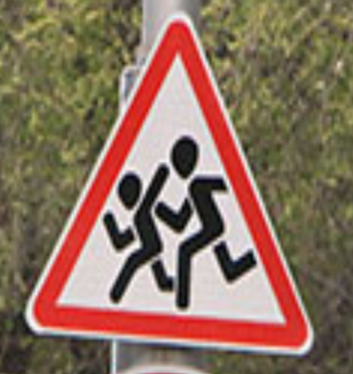

# Telegram Bot
## You can try the bot [here](https://t.me/Sigh_recognitor_bot "Telegram Bot")

### The bot was created using aiogram and deployed via Heroku. Deploying took me a while to struggle because Tensorlow was to larg to load to the server, so I had to use Tensorflow-cpu in requirements.

### Wht you can find in this directory

* Images that bot uses to show examples;
* bot.py - bot application;
* config.py - important predefined variables;
* model.json - model's architecture that bot uses to guess input images;
* weights.h5 - model's weights used by bot while defining model;
* model_predict.py - tools that bot uses to predict an output;
* Procfile - bot file used on Heroku;
* reqirements.txt, weights.txt - files used while deploying bot to Heroku.

### How it works

* The bot greets the user and shows possible images that can be guessed;
* User sends an image. The image should look like:

* The bot downloads it and runs functions defined in 'model_predict.py' file - preprocess the image and make prediction on it;
* The user gets a response within less than 1 second.

### Important!

If the bot doesn't work - it means that it is asleep. I have connected Heroku + Kaffeine and it should ping my bot every 30 minutes but, of course, something may always go wrong. I will try to ckeck it often and manually turn on when possible.

The bot is not working from 23:00 GMT to 5:00 GMT. 