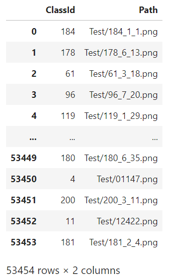
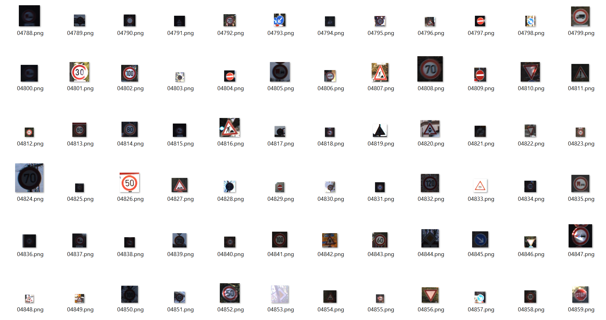
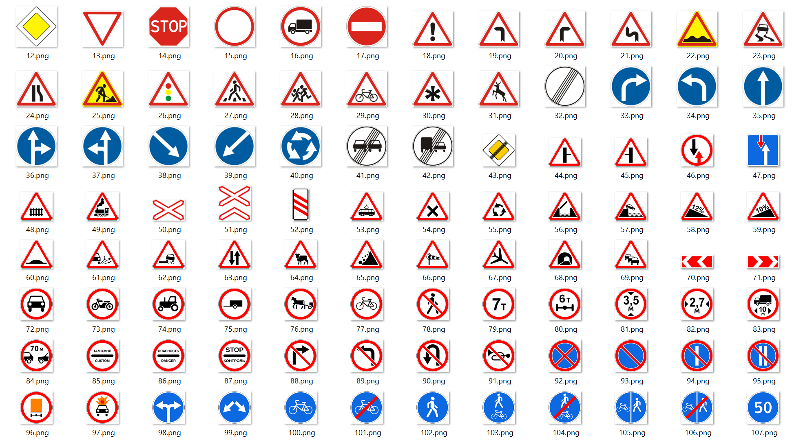
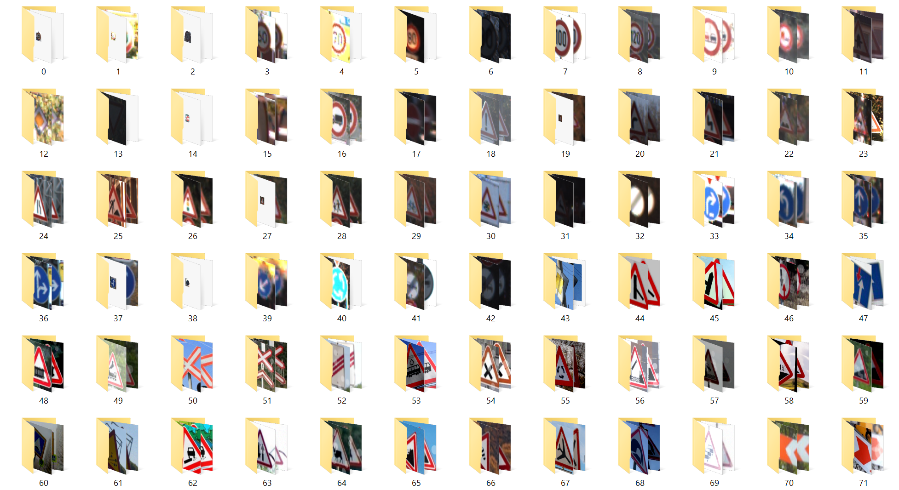
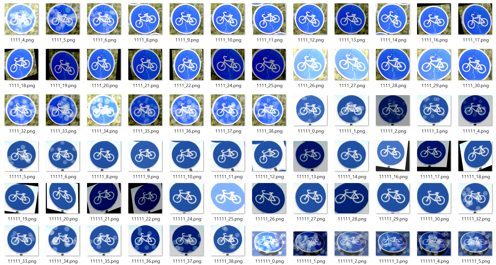

# Data

## Full data can be found and downloaded [here](https://www.kaggle.com/datasets/daniildeltsov/traffic-signs-gtsrb-plus-162-custom-classes "kaggle link")

### In this repository you can find all the data I collected and used while training and evaluating the CNN model. Test folder 50k+ images (53455 total), train folder 205 subfolders with 95k+ images (97426 total).

### Test_data.csv

First of all, you can find Test_data.csv which has a structure like:

This file is used after training to evaluate model's performance on a test set in Test folder. The Test_data.csv file include all images from Test folder in a mixed order.

### Test

Test folder include complitely mixed order of images (linked with Test_data.csv), all the images were extracted (completely removed) from train folder and augmented so as to avoid data leakage. The folder looks like:

### Meta 

The Meta folder consists of pattern images for each class, and looks like this:

### Train

The train folder consists of 205 folder enumerated from 0 to 204 making it easier to loop through them while image preprocessing. Each of the nested folders contain images of one traffic sign (cropped and augmented images from google images).
The Train folder looks like this:

And all the nested folders have a structure like:

