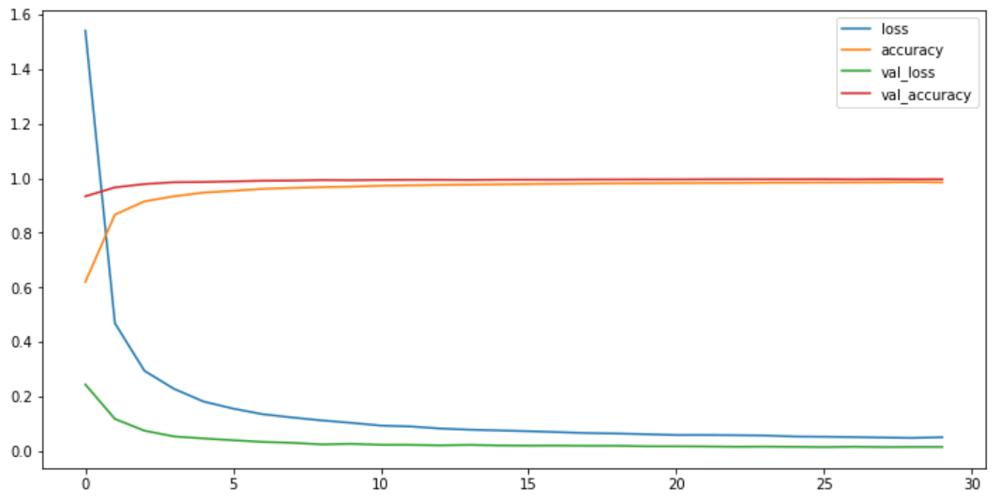
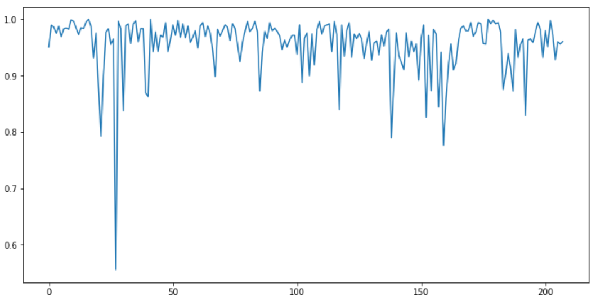

# Realization in Jupyter

### The following directory contains realization in Jupyter Lab

#### What I did

* Imported all modules and defined config;
* Counted marked the number of classes we are going to work with in the train folder;
* The next step was to loop through all train folders and collect all the images:
	* Image collected from folder;
	* Image transforms like: read -> create from array (RGB) -> resize (30x30);
	* Created arrays with labels and images.
* Shuffling images, splitting into train and validation, X normalization, Y encoding and so on...
* I used simple CNN architecture like:
	* Block_1 - ConvD2 + Conv2D + MaxPool2D + BatchNormalization;
	* Block_2 - ConvD2 + Conv2D + MaxPool2D + BatchNormalization;
	* Block_3 - Flatten + Dense + BatchNormalization + Dropout;
	* Output - Dense.
* Included online augmentation while training.

#### What I got 

Pretty high score on training data and low loss:
* loss: 0.0509;
* accuracy: 0.9845;
* val_loss: 0.0153;
* val_accuracy: 0.9960.

So I created a test folder with more than 50k images that were extracted and augmented from train folder before training to avoid data leakage (you can read the explanation and follow my steps in the in the main README).

The preprocessing was almost the same as for training data.

##### Accuracy on test images was 0.9602

As you can see on the image on road sign is the outsider, why it is happening - you can read in the main README.

