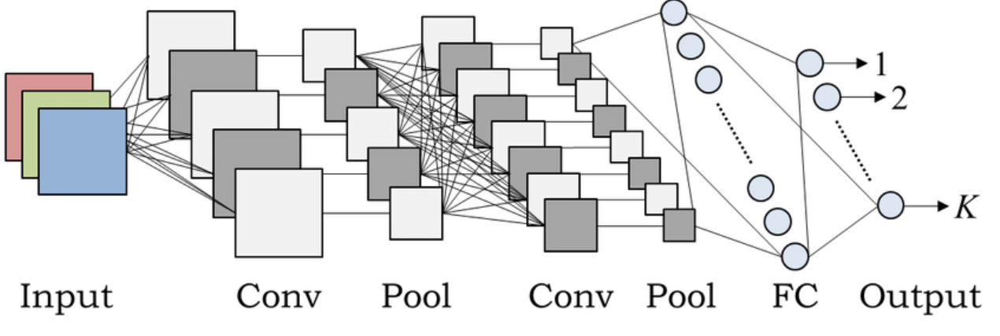

# Traffic Sign Recognition

### In the following repository you can find my researches, custom created dataset with more than 150k images and CNN model (weights can be downloaded) + online and offline augmentation of data.

* [Augmentation](Augmentation/) - contains scripts to perform custom augmentation on images;
* [Bot](Bot/) - contains Telegram bot deployed on Heroku and a description;
* [Data](Data/) - info how and where to download the full dataset;
* [Imgs](Imgs/) - images used in readme;
* [Model](Model/) - CNN model, its' weights, training script, predicting script and important notes for training;
* [Notebook](Notebook/) - realization in Jupyter-lab, plots, explanations;
* create_test.py - python file to create test folder and fill it with images from train folders.

### What I aimed to do

* Collect dataset with traffic signs, using already existing one (GTSRB);
* Prepare data for model training;
* Build CNN model capable of classifying traffic signs;
* Train model on augmented images, excluding a small part of it to use in the test set;
* Create test set, excluding and augmenting some images from train set (to avoid data leakage);
* Validate the model’s performance;
* Create Telegram Bot and deploy it on Heroku.

### What I actually did

* Downloaded excising GTSDB with 50k images (38k train / 12k test) consisting of 43 classes (most popular traffic signs). IMPORTANT: I also added some Russians and Ukrainian analogs to GTSDB. Then I manually added 162 classes giving in total 205 classes (not common, rare and extremely rare traffic signs which were hard even to collect, not counting train). The original dataset’s range distribution was something like 200-2000 images per class, but mostly 300-400. Consequently, I aimed to create something similar and manually found and properly cropped 5-40 images per class. Afterwards, performed custom built augmentation on the collected images, making 35 images out of one (the complete description of this process and an augmentation script can be found in [Augmentation](Augmentation/) directory). All in all, I managed to create partly balanced dataset with 205 classes and 100k train images (50k of test, read more to figure out how).
* Actually, I didn’t have to prepare data in any specific way… Just common image preprocessing transforming them into arrays, normalising splitting in train and validation sets and all other boring stuff that everyone knows. In fact, the hardest part was data collection and optimising the script to loop through folders while augmentating and training (yes, I had hundreds of gigabytes of images accidentally created, restored, renamed, overwritten and deleted…). But through hard times I managed to prepare everything, including test set and test.scv (read more to find out) for training and validation.
* When the data was ready I started to build CNN model and through experiments came to the point that the best result can be achieved with an architecture as:

Something like this but not exactly - in other words - pretty simple...

##### Input Block
* Conv2D (16, (3, 3), relu);
* Conv2D (32, (3, 3), relu);
* MaxPool2D ((2, 2));
* BatchNormalization;
##### Second Block
* Conv2D (64, (3, 3), relu);
* Conv2D (128, (3, 3), relu);
* MaxPool2D ((2, 2));
* BatchNormalization;
##### FC Bloc
* Flatten;
* Dense (512, relu);
* BatchNormalization;
* Dropout (0.5);
##### Output Block
* Dense (205, softmax). 

	The complete description of the model and its layers can be found in [Model](Model/) directory.
* The model was ready, so I created a simple script that removes random images from previously augmented train folder, stores them in a test folder and then augments everything (removing needed to avoid data leakage). When the data was pretty clear and the model ready, I created callbacks to track learning and added online augmentation while training:
	
	* rotation range = 10; 
	* zoom range = 0.15;
	* height shift range = 0.1;
	* width shift range = 0.1;
	* shear range = 0.15.

* After training the model and getting high scores on validation set, I created test.scv (looping through test folder and storing all paths) that will be used in testing out model and final evaluation.
* Evaluating model’s performance was pretty simple and gave score about 0.96 accuracy. The classes are not perfectly balanced so I also used F1-Score (the mean was 0.95) which also gave pretty high results. Seems good, but the model is not perfect enough (read Problems to find out…).
* Then I created Telegram [Bot](Bot/) that was deployed on Heroku. The bot is capable of responding to users input image with a prediction and percentage of confidence.

### Problems

* The least important problem is traffic sign location. I mean that it is not universal for every country and the dataset was collected using only Russian and partly Ukrainian traffic sign images (not counting existing 50k of German). So the model is not currently working with west of south countries’ signs.
* The biggest problem is sign detection (or localisation). Actually, I haven’t added this function yet, so if the model sees a big image with a lot of background, it will give a completely wrong answer. I have tried to use OpenCV (finding contours; canny edge detection; playing with grey shades to select the sign and cropp image) but all such solutions work under special conditions - canny can work with one image, but whenever I try the function on another preprocessed image, it gives wrong answer and can't highlight RoI. So basically, I have not found the working solution yet but will try soon.
* And the last problem appears due to the variety of traffic signs in one class as shown bellow:
	
	This is not critical and the value of F1-Score is pretty high in general, but that fact leads to increase in false detections and sometimes makes the model predict wrong answer. What I mean by high variety is that:

#### Road works

#### Pedestrians

